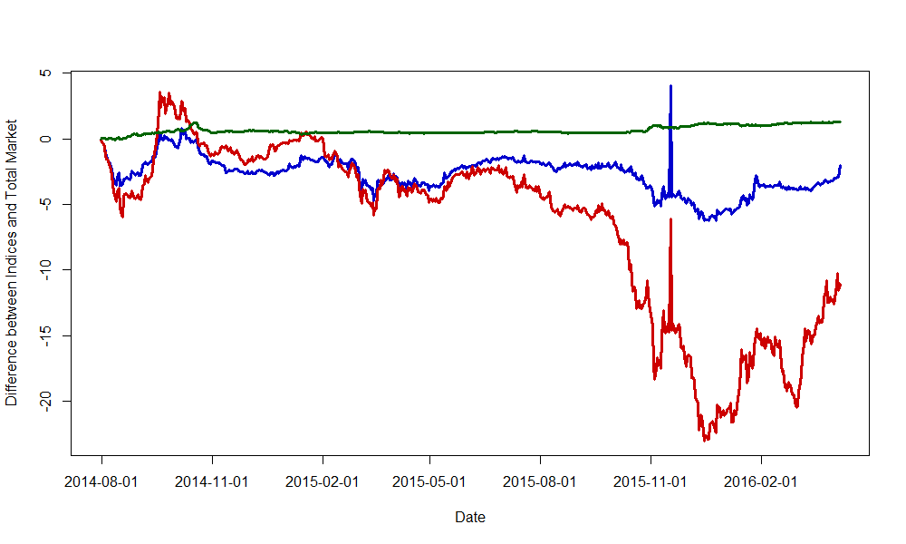

[](http://quantlet.de/)

## [](http://quantlet.de/) **CRIXfamdiff** [](http://quantlet.de/)

```yaml

Name of Quantlet : CRIXfamdiff

Published in : CRIX or evaluating blockchain based currencies

Description : 'CRIXfamdiff gives a plot which shows the differences between the indices in the CRIX
family and the total market. The data were calculated with the code CRIXcode.R.'

Keywords : CRIX, ECRIX, EFCRIX, index, cryptocurrency, crypto, plot

See also : 'CRIXcode, CRIXindex, ECRIXindex, EFCRIXindex, CRIXfamdiff, CRIXfamdiffloss, FDAXloss,
CRIXhnoptions, CRIXoutmarket, CRIXoutmarketTERES, CRIXvarreturn'

Author : Simon Trimborn

Submitted : Mon, May 30 2016 by Simon Trimborn

Datafile : crix.RData, ecrix.RData, efcrix.RData, TMI.RData

Example : Plot of the differences between the CRIX family indices and the total market.

```




### R Code:
```r
rm(list = ls(all = TRUE))
graphics.off()

# please change your working directory 
# setwd('C:/...')

load("crix.RData")
load("ecrix.RData")
load("efcrix.RData")
load("TMI.RData")

plot(TMI - crix, type = "l", col = "blue3", xaxt = "n", lwd = 3, 
  xlab = "Date", ylab = "Difference between Indices and Total Market", 
  ylim = c(min(TMI - crix, TMI - ecrix, 
  TMI - efcrix), max(TMI - crix, TMI - 
  ecrix, TMI - efcrix)))
lines(TMI - ecrix, type = "l", col = "red3", lwd = 3)
lines(TMI - efcrix, type = "l", col = "darkgreen", lwd = 3)
axis(1, at = c(2,94,186,275,367,459,551), label = names(crix)[c(2,94,186,275,367,459,551)])

```
