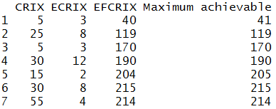

[](http://quantlet.de/)

## [](http://quantlet.de/) **CRIXmembers** [](http://quantlet.de/)

```yaml

Name of Quantlet : CRIXmembers

Published in : CRIX or evaluating blockchain based currencies

Description : 'Gives a matrix which shows the number of constituents of the indices in the periods.
The data were calculated with CRIXcode.R.'

Keywords : CRIX, index, cryptocurrency, crypto

See also : 'ECRIXindex, EFCRIXindex, CRIXfamdiff, CRIXfamdiffloss, FDAXloss, CRIXhnoptions,
CRIXoutmarket, CRIXoutmarketTERES, CRIXvarreturn'

Author : Simon Trimborn

Submitted : Mon, May 30 2016 by Simon Trimborn

Datafile : CRIXaic.RData, ECRIXaic.RData, EFCRIXaic.RData

Example : Matrix with the members in the indices.

```




### R Code:
```r
rm(list = ls(all = TRUE))
graphics.off()

# please change your working directory 
# setwd('C:/...')

load("CRIXaic.RData")
load("ECRIXaic.RData")
load("EFCRIXaic.RData")

numb_CRIX = (apply(CRIXaic, 1, function(x) length(x[!is.na(x)])) - 1) * 5
numb_ECRIX = apply(ECRIXaic, 1, function(x) length(x[!is.na(x)])) - 1
numb_EFCRIX = apply(EFCRIXaic, 1, which.min)
numb_TMI = apply(EFCRIXaic, 1, function(x) length(x[!is.na(x)]))

table_members = cbind(numb_CRIX, numb_ECRIX, numb_EFCRIX, numb_TMI)
colnames(table_members) = c("CRIX", "ECRIX", "EFCRIX", "Maximum achievable")
rownames(table_members) = 1:7
table_members

```
