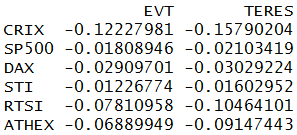

[](http://quantlet.de/index.php?p=info)

## [](http://quantlet.de/) **CRIXoutmarketTERES** [](http://quantlet.de/d3/ia)

```yaml

Name of Quantlet : CRIXoutmarketTERES

Published in : CRIX - a CRyptocurrency IndeX

Description : 'CRIXoutmarketTERES provides a matrix which shows the risk of S&P500, DAX, STI, RTSI
and ATHEX against CRIX measured by Expected Shortfall, estimated by an Extreme Value Approach (EVT)
and Tail Event Risk Expected Shortfall (TERES)'

Keywords : 'CRIX, index, cryptocurrency, crypto, plot, S&P500, btc, bitcoin, TERES, EVT, dax, sti,
rtsi, athex, expected shortfall'

See also : CRIXindex, CRIXhnoptions, CRIXoutmarket, CRIXvarreturn

Author : Simon Trimborn

Submitted : Fri, December 04 2015 by Simon Trimborn

Datafile : crix.csv, SP500_index.csv, DAX_index.csv, STI_index.csv, RTSI_index.csv, ATHEX_index.csv

Example : Matrix with the EVT and TERES result for S&P500, DAX, STI, RTSI, ATHEX and the CRIX.

```




### R Code:
```r
rm(list = ls(all = TRUE))
# please change your working directory
# setwd('C:/...')

# install and load packages
libraries = c("fGarch", "expectreg", "evd")
lapply(libraries, function(x) if (!(x %in% installed.packages())) {
  install.packages(x)
})
lapply(libraries, library, quietly = TRUE, character.only = TRUE)

plot_crix   = read.csv("crix.csv", header = T, row.names = 1)
index_SP500 = read.csv("SP500_index.csv", header = T)
index_DAX   = read.csv("DAX_index.csv", header = T)
index_STI   = read.csv("STI_index.csv", header = T)
index_RTSI  = read.csv("RTSI_index.csv", header = T)
index_ATHEX = read.csv("ATHEX_index.csv", header = T)
 
EScomp = function(data) {
  Stock      = data
  y          = Stock
  y          = diff(log(y))
  GARCHvola  = garchFit(~garch(1, 1), data = y, trace = F)
  ytest      = residuals(GARCHvola)/volatility(GARCHvola)
  ywhite     = residuals(GARCHvola)/volatility(GARCHvola) 
  windowsize = length(y) - 1
  theta      = 0.01
  qtheta     = quantile(y, theta)
  tau        = theta
  for (i in 1:10000) {
    etau = expectile(y, tau)
    if (etau < qtheta) {
      if (tau < 0.9999) {
        tau = tau + 1e-04
      } else {
        break
      }
    }
    if (etau > qtheta) {
      if (tau > 1e-04) {
        tau = tau - 1e-04
      } else {
        break
      }
    } else {
      break
    }
  }

  results = matrix(0, 5, (length(y) - windowsize))

  testExp       = c()
  testExpFunc   = c()
  testHist      = c()
  testEvt       = c()
  varind        = 0
  varianceStore = c()
  volaStore     = c()

  for (z in seq(1, length(y) - windowsize)) {
    window = y[z:(z + windowsize)]
    whitewindow = ywhite[z:(z + windowsize)]
    qtheta = quantile(window, theta)

    for (i in 1:10000) {
      etau = expectile(window, tau)
      if (etau < qtheta) {
        if (tau < 0.9999) {
          tau = tau + 1e-05
        } else {
          break
        }
      }
      if (etau > qtheta) {
        if (tau > 1e-04) {
          tau = tau - 1e-05
        } else {
          break
        }
      } else {
        break
      }
    }
 
    ex       = expectile(window, tau)
    expectES = ex * (1 + tau/((1 - 2 * tau) * theta))

    L     = -whitewindow
    zq    = quantile(L, 1 - theta)
    thr   = quantile(L, 0.9)
    fitty = fpot(L, thr, model = "gpd", std.err = F)
    scale = as.numeric(fitty$scale)
    shape = as.numeric(fitty$param[2])
    evtES = -(zq/(1 - shape) + (scale - shape * thr)/(1 - shape))

    results[1, z] = GARCHvola@fit$par[1]
    results[2, z] = volatility(GARCHvola)[length(volatility(GARCHvola))]
    results[3, z] = expectES
    results[4, z] = evtES
    results[5, z] = tau
  }
  results
}
 
ES_CRIX  = EScomp(plot_crix$Price)
ES_SP500 = EScomp(index_SP500$Price)
ES_DAX   = EScomp(index_DAX$Price)
ES_STI   = EScomp(index_STI$Price)
ES_RTSI  = EScomp(index_RTSI$Price)
ES_ATHEX = EScomp(index_ATHEX$Price)

table_ES = matrix(c(ES_CRIX[4, 1] * ES_CRIX[2, 1] + ES_CRIX[1, 1], ES_CRIX[3, 1], 
  ES_SP500[4, 1] * ES_SP500[2, 1] + ES_SP500[1, 1], ES_SP500[3, 1], ES_DAX[4, 1] * 
    ES_DAX[2, 1] + ES_DAX[1, 1], ES_DAX[3, 1], ES_STI[4, 1] * ES_STI[2, 1] + 
    ES_STI[1, 1], ES_STI[3, 1], ES_RTSI[4, 1] * ES_RTSI[2, 1] + ES_RTSI[1, 1], 
  ES_RTSI[3, 1], ES_ATHEX[4, 1] * ES_ATHEX[2, 1] + ES_ATHEX[1, 1], ES_ATHEX[3, 
    1]), nrow = 6, ncol = 2, byrow = T)
colnames(table_ES) = c("EVT", "TERES")
rownames(table_ES) = c("CRIX", "SP500", "DAX", "STI", "RTSI", "ATHEX")
table_ES 

```
