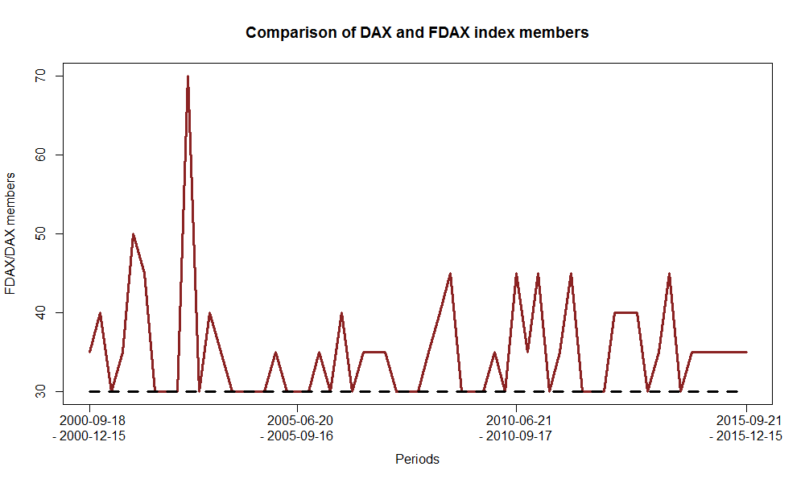

[](http://quantlet.de/)

## [](http://quantlet.de/) **FDAXmembers** [](http://quantlet.de/)

```yaml

Name of Quantlet : FDAXmembers

Published in : CRIX or evaluating blockchain based currencies

Description : 'Gives a matrix which shows the number of constituents of the FDAX and DAX in the
periods. The data were calculated with CRIXcode.R.'

Keywords : CRIX, DAX, index, cryptocurrency, crypto

See also : 'CRIXcode, CRIXindex, ECRIXindex, EFCRIXindex, FDAXmembers, CRIXfamdiff,
CRIXfamdiffloss, FDAXloss, CRIXhnoptions, CRIXoutmarket, CRIXoutmarketTERES, CRIXvarreturn'

Author : Simon Trimborn

Submitted : Mon, May 30 2016 by Simon Trimborn

Datafile : FDAaic.RData

Example : Plot with the number of constituents of FDAX and DAX.

```




### R Code:
```r
rm(list = ls(all = TRUE))
graphics.off()

# please change your working directory 
# setwd('C:/...')

load("FDAXaic.RData")

numb_FDAX = (apply(FDAXaic, 1, function(x) length(x[!is.na(x)])) - 1) * 5 + 25

plot(numb_FDAX, mgp = c(3, 1, 0), lwd = 3, type = "l", col = "brown4", xaxt = "n", xlab = "Periods", ylab = "FDAX/DAX members", main = "Comparison of DAX and FDAX index members")
lines(1:length(numb_FDAX),rep(30,length(numb_FDAX)), lwd = 3, lty = 2)
axis(1, mgp = c(3,1.5,0), at = c(1,20,40,61), label = c("   2000-09-18 \n- 2000-12-15", "   2005-06-20 \n- 2005-09-16", "   2010-06-21 \n- 2010-09-17", "   2015-09-21 \n- 2015-12-15") )

```
