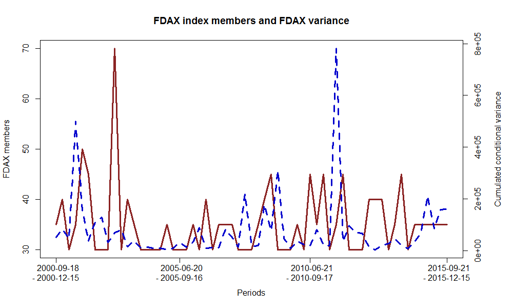

[](http://quantlet.de/)

## [](http://quantlet.de/) **FDAXmembersvar** [](http://quantlet.de/)

```yaml

Name of Quantlet : FDAXmembersvar

Published in : CRIX or evaluating blockchain based currencies

Description : 'Gives a plot which shows the number of constituents of the FDAX and its variance in
the periods. The data were calculated with CRIXcode.R.'

Keywords : CRIX, DAX, index, cryptocurrency, crypto, variance, GARCH

See also : 'CRIXcode, CRIXindex, ECRIXindex, EFCRIXindex, FDAXmembers, CRIXfamdiff,
CRIXfamdiffloss, FDAXloss, CRIXhnoptions, CRIXoutmarket, CRIXoutmarketTERES, CRIXvarreturn'

Author : Simon Trimborn

Submitted : Mon, May 30 2016 by Simon Trimborn

Datafile : FDAXaic.RData, FDAX.RData, DatesReallo.RData

Example : Plot with the number of constituents of FDAX and the variance.

```




### R Code:
```r
rm(list = ls(all = TRUE))
graphics.off()

# please change your working directory 
# setwd('C:/...')

# install and load packages
libraries = c("fGarch")
lapply(libraries, function(x) if (!(x %in% installed.packages())) {
  install.packages(x)
})
lapply(libraries, library, quietly = TRUE, character.only = TRUE)

load("FDAXaic.RData")
load("FDAX.RData")
load("DatesReallo.RData")

numb_FDAX = (apply(FDAXaic, 1, function(x) length(x[!is.na(x)])) - 1) * 5 + 25

list_garch = list()
for (i in 1:(length(DatesReallo)+1)){
  if (i == 1){
    list_garch[[i]] = sum(garchFit(data = FDAX[1:which(names(FDAX) == DatesReallo[1])])@h.t)
  } else if (i == (length(DatesReallo)+1)) {
    list_garch[[i]] = sum(garchFit(data = FDAX[(which(names(FDAX) == DatesReallo[length(DatesReallo)])+1):length(FDAX)])@h.t)
  } else {
    list_garch[[i]] = sum(garchFit(data = FDAX[(which(names(FDAX) == DatesReallo[i-1])+1):which(names(FDAX) == DatesReallo[i])])@h.t)
  }
}

par(mar=c(5,4,4,5)+.1)
plot(numb_FDAX, mgp = c(3, 1, 0), lwd = 3, type = "l", col = "brown4", xaxt = "n", xlab = "Periods", ylab = "FDAX members", main = "FDAX index members and FDAX variance")
axis(1, mgp = c(3,1.5,0), at = c(1,20,40,61), label = c("   2000-09-18 \n- 2000-12-15", "   2005-06-20 \n- 2005-09-16", "   2010-06-21 \n- 2010-09-17", "   2015-09-21 \n- 2015-12-15") )
par(new=TRUE)
plot(1:length(list_garch), unlist(list_garch), lwd = 3,type="l",col="blue3",xaxt="n",yaxt="n",xlab="",ylab="", lty = 2)
axis(4)
mtext("Cumulated conditional variance",side=4,line=3)

```
