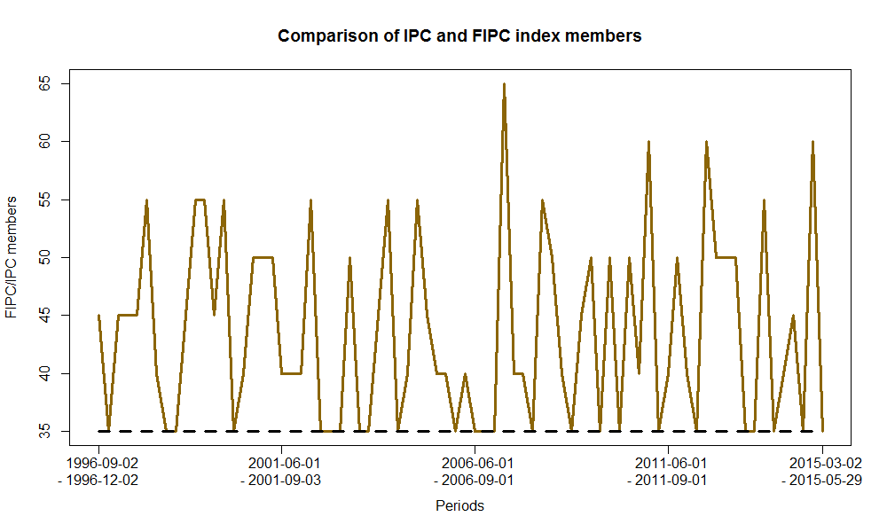

[](http://quantlet.de/)

## [](http://quantlet.de/) **FIPCmembers** [](http://quantlet.de/)

```yaml

Name of Quantlet : FIPCmembers

Published in : CRIX or evaluating blockchain based currencies

Description : 'Gives a matrix which shows the number of constituents of the FIPC and IPC in the
periods. The data were calculated with CRIXcode.R.'

Keywords : CRIX, IPC, index, cryptocurrency, crypto

See also : 'CRIXcode, CRIXindex, ECRIXindex, EFCRIXindex, FDAXmembers, CRIXfamdiff,
CRIXfamdiffloss, FDAXloss, CRIXhnoptions, CRIXoutmarket, CRIXoutmarketTERES, CRIXvarreturn'

Author : Simon Trimborn

Submitted : Mon, May 30 2016 by Simon Trimborn

Datafile : FIPCaic.RData

Example : Plot with the number of constituents of FIPC and IPC.

```




### R Code:
```r
rm(list = ls(all = TRUE))
graphics.off()

# please change your working directory 
# setwd('C:/...')

load("FIPCaic.RData")

numb_FIPC = (apply(FIPCaic, 1, function(x) length(x[!is.na(x)])) - 1) * 5 + 30

plot(numb_FIPC, mgp = c(3, 1, 0), lwd = 3, type = "l", col = "darkgoldenrod4", xaxt = "n", xlab = "Periods", ylab = "FIPC/IPC members", main = "Comparison of IPC and FIPC index members")
lines(1:length(numb_FIPC),rep(35,length(numb_FIPC)), lwd = 3, lty = 2)
axis(1, mgp = c(3,1.5,0), at = c(1,20,40,60,76), label = c("   1996-09-02 \n- 1996-12-02", "   2001-06-01 \n- 2001-09-03", "   2006-06-01 \n- 2006-09-01", "   2011-06-01 \n- 2011-09-01", "   2015-03-02 \n- 2015-05-29") )

```
